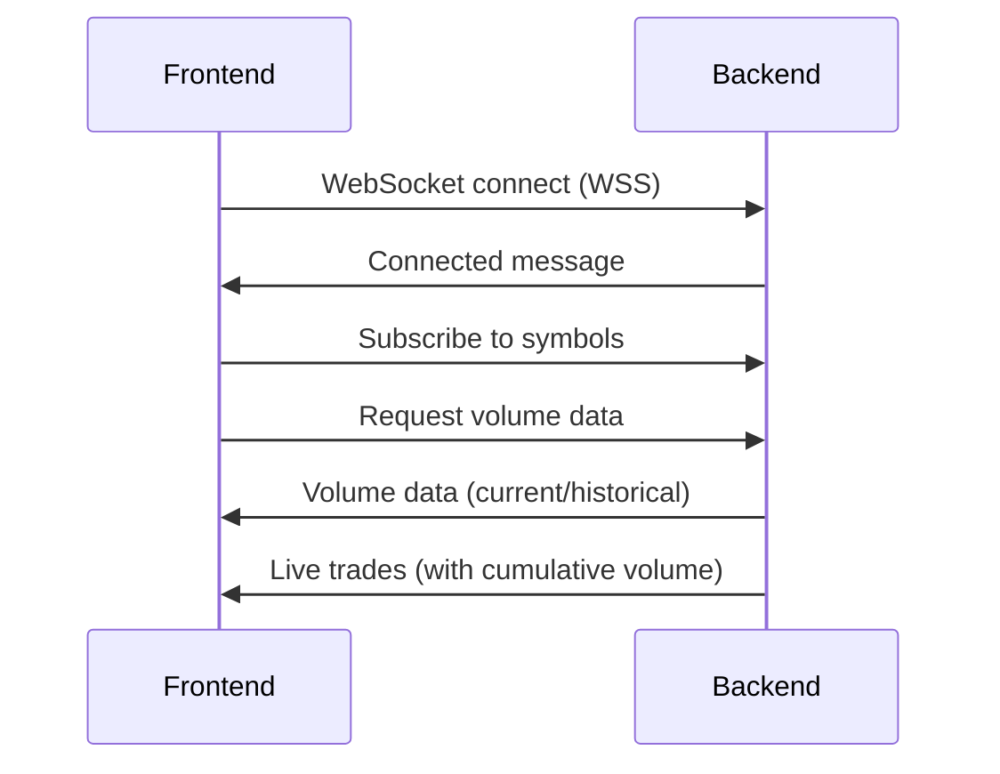

# Frontend Integration Updates for Shared Alpaca Architecture

## ✅ Changes Completed

### 1. **Environment Variables Updated** (`.env`)
```diff
- VITE_ALPACA_PROXY_WS_URL=ws://IRAuto-Alpac-6P4vTH9n3JEA-1469477952.us-east-1.elb.amazonaws.com/ws
+ VITE_ALPACA_PROXY_WS_URL=wss://YOUR_CLOUDFRONT_DOMAIN.cloudfront.net/ws
```

**⚠️ Action Required**: Replace `YOUR_CLOUDFRONT_DOMAIN` with the actual CloudFront domain from your production deployment.

### 2. **Enhanced Message Interfaces** (`alpacaService.ts`)
Added support for new backend message types:

```typescript
interface ProxyTradeMessage {
  type: 'trade';
  symbol: string;
  price: number;
  size: number;
  timestamp: string;
  cumulative_volume?: number; // 🆕 Backend-provided cumulative volume
  after_hours_mode?: boolean; // 🆕 Indicates after-hours tracking
}

interface VolumeDataMessage {
  type: 'volume_data';
  ticker: string;
  cumulative_volume: number;
  mode: 'live_after_hours' | 'historical';
  date?: string;
  timestamp: string;
}

interface VolumeRequestMessage {
  type: 'get_volume';
  ticker: string;
}
```

### 3. **Enhanced Trade Message Handling**
- **Prioritizes backend cumulative volume** over local tracking
- **Falls back to local tracking** if backend doesn't provide cumulative data
- **Handles after-hours mode indicators** from backend

### 4. **New Volume Data Request Functionality**
```typescript
// Request volume data for specific ticker
alpacaService.requestVolumeData('AAPL');

// Request volume data for multiple tickers
alpacaService.requestVolumeDataForSymbols(['AAPL', 'MSFT']);
```

### 5. **Updated Hook Interface** (`useAlpacaMarketData.ts`)
Added new functions to the hook return value:
```typescript
const {
  marketData,
  isConnected,
  // ... existing properties
  requestVolumeData,           // 🆕 Request volume for single ticker
  requestVolumeDataForSymbols  // 🆕 Request volume for multiple tickers
} = useAlpacaMarketData(['AAPL', 'MSFT']);
```

### 6. **Automatic Volume Data Fetching**
- Requests initial volume data when symbols change
- Requests volume data when WebSocket connection is established
- Handles both live and historical volume data responses

## 🔄 **How It Works Now**

### **Connection Flow**:


### **Data Flow**:

#### **During After-Hours (4-8 PM ET)**:
1. Frontend subscribes to symbols
2. Backend sends live trades with `cumulative_volume` field
3. Frontend uses backend cumulative volume (authoritative)
4. Volume persists in backend database

#### **During Off-Hours**:
1. Frontend requests volume data
2. Backend responds with historical `volume_data` message
3. Frontend displays previous day's final volume
4. No live trade data (market closed)

#### **Weekends**:
1. Backend automatically serves most recent weekday data
2. Frontend receives historical volume from last trading day

### **Message Examples**:

#### **Volume Data Request**:
```json
{
  "type": "get_volume",
  "ticker": "AAPL"
}
```

#### **Volume Data Response (After-Hours)**:
```json
{
  "type": "volume_data",
  "ticker": "AAPL",
  "cumulative_volume": 1500000,
  "mode": "live_after_hours",
  "timestamp": "2025-01-08T19:30:00"
}
```

#### **Volume Data Response (Historical)**:
```json
{
  "type": "volume_data",
  "ticker": "AAPL",
  "cumulative_volume": 2000000,
  "mode": "historical",
  "date": "2025-01-07",
  "timestamp": "2025-01-08T10:00:00"
}
```

#### **Enhanced Trade Message (After-Hours)**:
```json
{
  "type": "trade",
  "symbol": "AAPL",
  "price": 180.50,
  "size": 100,
  "cumulative_volume": 1500100,
  "after_hours_mode": true,
  "timestamp": "2025-01-08T19:30:15"
}
```

## 🚀 **Benefits of New Architecture**

### ✅ **Secure Connection**
- WSS works with HTTPS Vercel frontend
- No mixed content security issues

### ✅ **Persistent Volume Data**
- Volume data survives app restarts
- Consistent across dev/prod environments
- Backend handles database persistence

### ✅ **Smart Time-Based Logic**
- Automatically switches between live and historical data
- Handles after-hours, weekends, and holidays
- No frontend time logic needed

### ✅ **Single Source of Truth**
- Backend database is authoritative for volume data
- No local/server data conflicts
- Shared data across all environments

## 🔧 **Next Steps**

### **1. Update Environment Variable**
Replace the placeholder CloudFront URL with the actual domain from your production stack outputs:

```bash
# Check stack outputs for the actual CloudFront domain
ENV=production cdk list --app "python3 app.py" 
```

Look for output like: `wss://d123456789.cloudfront.net/ws`

### **2. Deploy and Test**
1. Deploy your production stack
2. Update the environment variable with the real CloudFront URL
3. Test WebSocket connection from your Vercel frontend
4. Verify volume data requests work properly

### **3. Usage in Components**
```typescript
// In your React components
const { 
  marketData, 
  isConnected, 
  requestVolumeData 
} = useAlpacaMarketData(['AAPL', 'MSFT']);

// Request volume data for a new symbol
const handleRequestVolume = (ticker: string) => {
  requestVolumeData(ticker);
};

// Access cumulative volume from marketData
const appleVolume = marketData['AAPL']?.cumulativeVolume || 0;
```

Your frontend is now ready to work with the new shared, persistent, secure Alpaca WebSocket architecture! 🎉